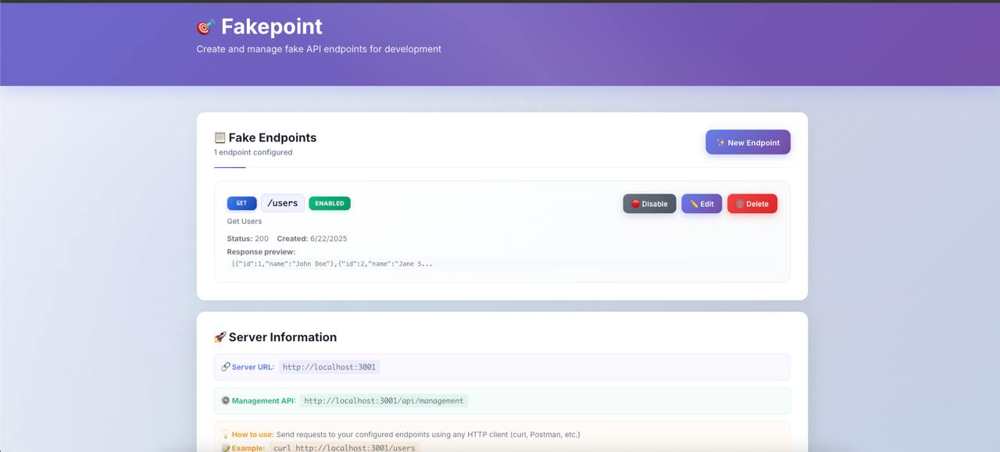

# 🎯 Fakepoint

A simple tool for creating fake API endpoints during development. Set up mock endpoints with custom responses without writing any backend code.



*Fakepoint's beautiful, modern interface makes API mocking a breeze*

## ✨ Features

- **🎨 Beautiful Interface**: Modern, gradient-powered UI with smooth animations
- **🚀 Easy Setup**: Create fake API endpoints through a simple web interface
- **🎯 Custom Responses**: Define custom JSON responses, status codes, and headers
- **🔄 Multiple HTTP Methods**: Support for GET, POST, PUT, DELETE, PATCH
- **⚡ Real-time Management**: Enable/disable endpoints on the fly
- **📱 Responsive Design**: Works perfectly on desktop, tablet, and mobile
- **🛡️ TypeScript**: Full type safety throughout the application
- **🎭 Professional Grade**: Enterprise-ready styling and user experience

## Project Structure

```
fakepoint/
├── packages/
│   ├── server/          # Node.js/Express backend
│   │   ├── src/
│   │   │   ├── index.ts           # Main server file
│   │   │   ├── store.ts           # In-memory endpoint storage
│   │   │   ├── routes/
│   │   │   │   └── management.ts  # CRUD API for endpoints
│   │   │   └── middleware/
│   │   │       └── fakeEndpoint.ts # Handles fake endpoint requests
│   │   └── package.json
│   ├── client/          # React frontend
│   │   ├── src/
│   │   │   ├── App.tsx            # Main app component
│   │   │   ├── api.ts             # API client
│   │   │   ├── components/
│   │   │   │   ├── EndpointList.tsx
│   │   │   │   └── EndpointForm.tsx
│   │   │   └── styles.css
│   │   └── package.json
│   └── shared/
│       └── types.ts     # Shared TypeScript types
└── package.json         # Root package.json with workspaces
```

## Getting Started

### Prerequisites

- Node.js 18+ 
- npm or yarn

### Installation

1. **Install dependencies:**
   ```bash
   npm install
   ```

2. **Start the development servers:**
   ```bash
   npm run dev
   ```

   This will start:
   - Backend server on http://localhost:3001
   - Frontend app on http://localhost:3000

3. **Open your browser:**
   Visit http://localhost:3000 to access the Fakepoint interface

## Usage

### Creating a Fake Endpoint

1. Click "New Endpoint" in the web interface
2. Fill out the form:
   - **Name**: A descriptive name for your endpoint
   - **HTTP Method**: GET, POST, PUT, DELETE, or PATCH
   - **Path**: The URL path (e.g., `/users`, `/api/posts`)
   - **Status Code**: HTTP status code to return (default: 200)
   - **Headers**: Custom response headers as JSON
   - **Response Body**: The JSON response to return

3. Click "Create" to save the endpoint

### Using Your Fake Endpoints

Once created, your fake endpoints are immediately available at:
```
http://localhost:3001{your-path}
```

#### Examples

**Create a user endpoint:**
- Method: `POST`
- Path: `/api/users`
- Response: `{"id": 1, "name": "John Doe", "created": true}`

**Use it:**
```bash
curl -X POST http://localhost:3001/api/users
# Returns: {"id": 1, "name": "John Doe", "created": true}
```

**Create a users list endpoint:**
- Method: `GET` 
- Path: `/api/users`
- Response: `[{"id": 1, "name": "John"}, {"id": 2, "name": "Jane"}]`

**Use it:**
```bash
curl http://localhost:3001/api/users
# Returns: [{"id": 1, "name": "John"}, {"id": 2, "name": "Jane"}]
```

### Managing Endpoints

- **Edit**: Click the "Edit" button to modify an existing endpoint
- **Enable/Disable**: Toggle endpoints on/off without deleting them
- **Delete**: Remove endpoints permanently

## API Reference

### Management API

The management API is available at `http://localhost:3001/api/management`

#### Endpoints

- `GET /api/management/endpoints` - List all fake endpoints
- `POST /api/management/endpoints` - Create a new fake endpoint
- `GET /api/management/endpoints/:id` - Get a specific endpoint
- `PUT /api/management/endpoints/:id` - Update an endpoint
- `DELETE /api/management/endpoints/:id` - Delete an endpoint
- `PATCH /api/management/endpoints/:id/toggle` - Enable/disable an endpoint

#### Health Check

- `GET /api/health` - Server health check

## Development

### Available Scripts

From the root directory:

- `npm run dev` - Start both server and client in development mode
- `npm run dev:server` - Start only the server
- `npm run dev:client` - Start only the client
- `npm run build` - Build both server and client for production
- `npm run start` - Start the production server

### Server Scripts

In `packages/server`:

- `npm run dev` - Start server in development mode with hot reload
- `npm run build` - Build server for production
- `npm run start` - Start production server

### Client Scripts

In `packages/client`:

- `npm run dev` - Start client development server
- `npm run build` - Build client for production
- `npm run preview` - Preview production build

## Use Cases

- **Frontend Development**: Mock backend APIs while building React/Vue/Angular apps
- **API Design**: Prototype API responses before implementing backend logic
- **Testing**: Create predictable endpoints for automated tests
- **Demos**: Quickly set up data for presentations or demos
- **Learning**: Experiment with different API patterns and responses

## Contributing

1. Fork the repository
2. Create a feature branch
3. Make your changes
4. Add tests if applicable
5. Submit a pull request

## License

MIT License - see LICENSE file for details 